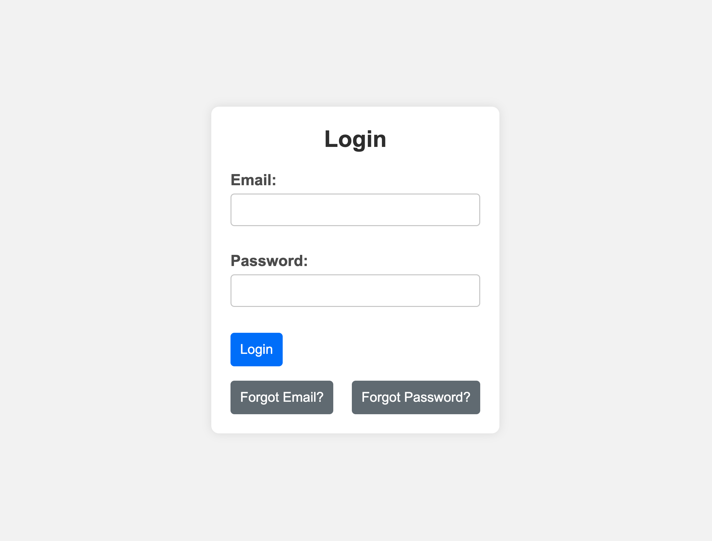
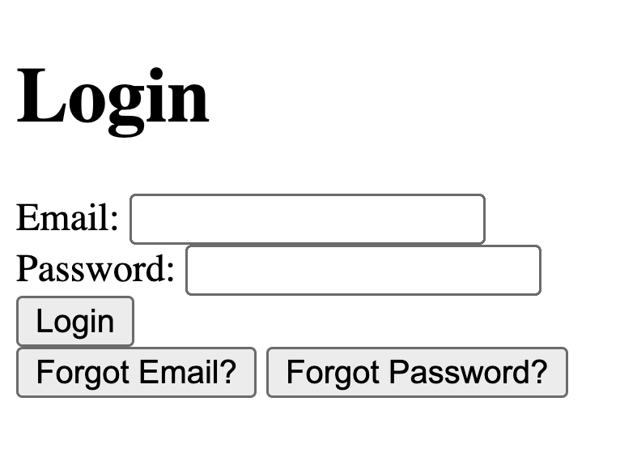

# Create and Style a Login Form with the help of AI

### Here is an example of what you could create.


## Description 📄
In this assignment, you will create and style a modern login form with the help of AI. The focus will be on structuring the HTML and applying CSS for a polished, responsive design.

This activity is meant to be done solo.
Customize the styles and form content as you like. 
Make it your own!

##

## Project Structure

In this assignment, you are provided with the following file structure:

```
LoginForm/
├── index.html
└── styles.css
```

# Instructions ✅

## 1. **Create the Project Folder and Files**
   - [ ] Create a folder named `LoginForm` to store all your project files.
   
   - [ ] Inside the `LoginForm` folder, create a file named `index.html`. This will be your main HTML file.
   
   - [ ] Also, in the `LoginForm` folder, create another file named `styles.css`. This file will contain the CSS used to style your HTML content.


## 2. **Build a Basic HTML Boilerplate**
Begin by building the foundation of your webpage using an HTML boilerplate. Need assistance? Just ask AI!

- [ ] Ask AI how to create the boilerplate for your HTML project. 

- [ ] Ask for help with linking your CSS file while building out the boilerplate structure. 

- [ ] Paste your code into your empty `index.html` file.

**Explanation:**
- Declares the document as HTML5 and sets up the essential metadata and styles.

## 3. **Create the Login Form Structure** 
Next, add the HTML elements needed for a login form, such as input fields for a username and password. 

- [ ] Ask AI: "How do I structure a basic login form in HTML? 

- [ ] Specify to AI the fields you want to include in your login form.

- [ ] Ask AI where to insert the login form code within your HTML boilerplate.

**Explanation:**
- We're using AI to help structure and build a simple login form in HTML by providing guidance on field selection.

## 3. **Now let's test our unstyled code for our basic login form**

- [ ] Open the index.html file in your browser to view your login form as it currently appears.

##

**Explanation:**
- You should see a page resembling the screenshot below.



##

 ### Let's add some CSS styling!

 Keep in mind that when asking AI for help with styling, you may need to supply your `HTML` code so it knows which classes or IDs you may have used.

## 4. **Apply CSS styling to the form.**
Once you have all your `HTML` code in place you should be ready to move on to styling the form.

- [ ] Ask AI for help applying CSS Reset code to your project. Be sure to include that you want to reset the margin, padding, and box styles.

- [ ] Ask AI for help styling the login form. You could say: "How can I style the container to center a login form on the page?"

- [ ] Style the Form Input: Ask AI, "How can I style my input fields and buttons for a cohesive design?"

- [ ] Style the Form Input Elements: Ask AI, "How can I style input fields and buttons for a consistent look?"

**Explanation:**
- We used AI to guide us in applying a CSS Reset, centering the login form, and styling the input fields and buttons for a cohesive and consistent design.

## 5. **Testing Your Project**
Now, let's see how your styled project is coming along.

- [ ] Open your `index.html` file in a web browser.

- [ ] Verify that the login form is centered on the page and that all elements are styled correctly.

- [ ] Test the form's responsiveness by resizing your browser window to see how the layout adapts.

- [ ] Customize the styles and form content as you like with the assistance of AI if needed.

- [ ] Look through all your code and ask AI to explain anything you do not understand in both the `html` and `css` files.

- [ ] Ask for AI help (if needed) to change colors and styles throughout your form. Make it your own. 

**Explanation:**
- In this step, you'll test your project by opening it in a browser to ensure the login form is centered and styled correctly. 

## 

**Conclusion**

By completing this project, you should have learned how to structure a simple HTML form and style it using CSS, with a focus on creating a visually appealing and responsive design. You also learned how to effectively use AI to assist in your coding process.

##

### Solution codebase 👀
🛑 **Only use this as a reference** 🛑

💾 **Not something to copy and paste** 💾

**Note:**  This lab references a solution file located [here](https://github.com/HackerUSA-CE/aisd-wde-03-styling-a-form/tree/solution) (link not shown).

---

© All rights reserved to ThriveDX

